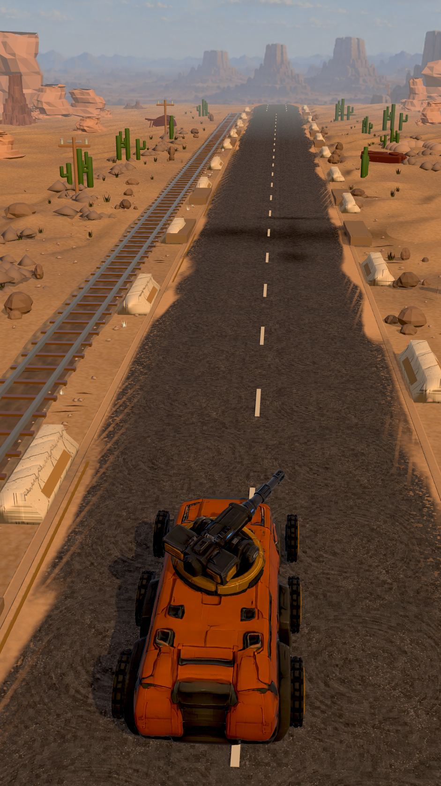
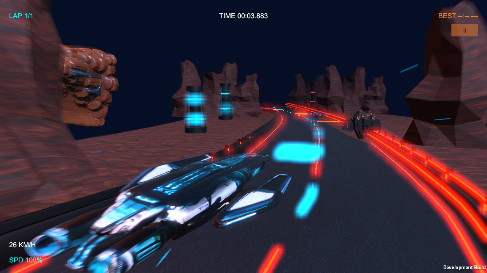
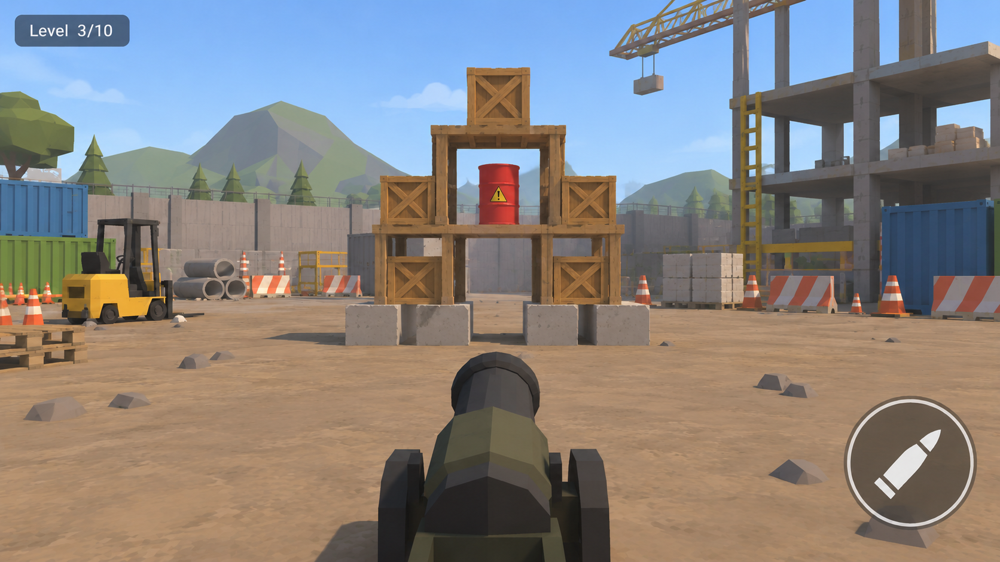
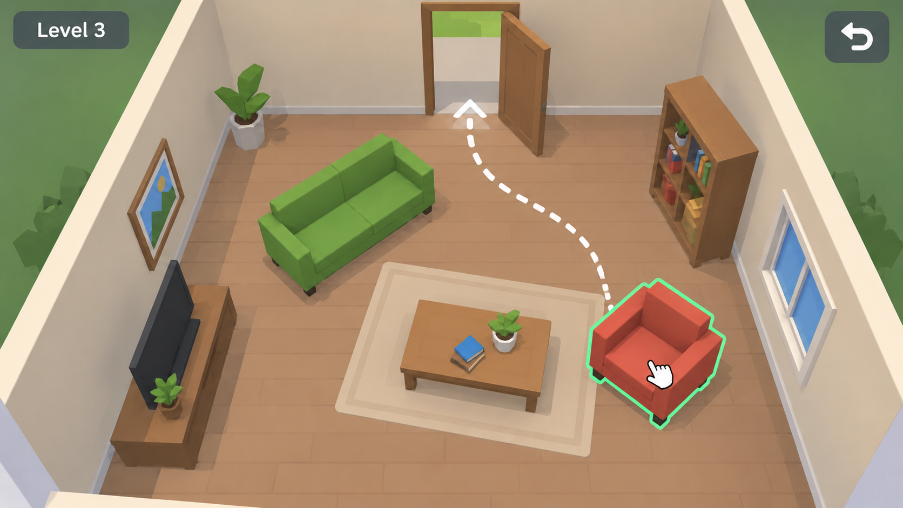
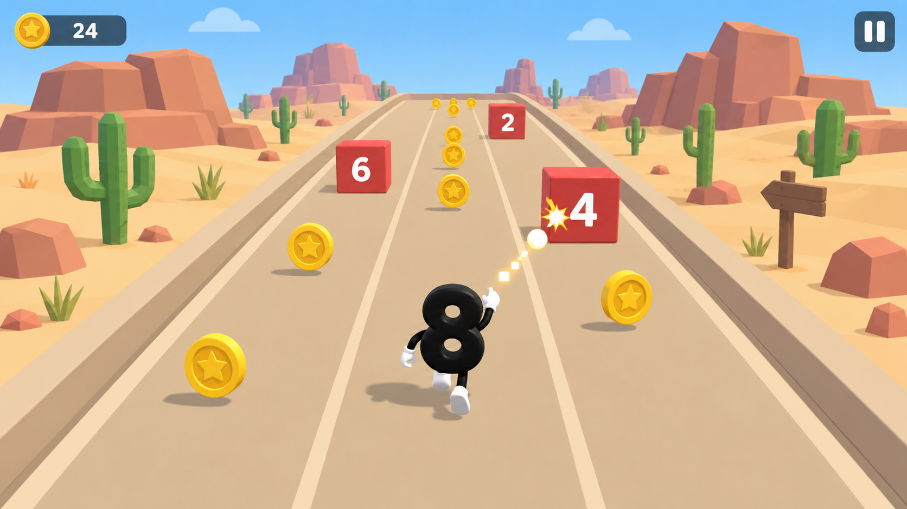

# Moha Saker — Unity Mobile Game Development

I build focused 3D mobile games and gameplay prototypes in Unity and C#. My work covers the full playable loop: controls, camera, physics, AI, UI, optimization, SDK integration, testing, and release support for iOS and Android.

> This is a portfolio showcase. The commercial project source code and production assets remain private. The repository intentionally contains no Unity project files, credentials, signing material, or distributable source packages.

## Featured work

### ROADFORGE — shipped iOS game

A mobile driving game built around readable roads, responsive vehicle handling, short sessions, and production-ready release workflows.

- Unity / C# 3D gameplay
- Mobile input and camera tuning
- UI, level flow, QA, and performance passes
- iOS release; Android release work in progress
- [Project page](https://uploadforsoftware.com/projects/roadforge/)

### Neon Moto Drift — racing prototype

An arcade motorcycle prototype exploring touch steering, traffic behavior, drift feedback, and checkpoints.

- Unity 6 prototype
- Touch-first control loop
- Vehicle camera and AI traffic experiments
- Fast iteration on feel and readability

### TNT Crash — physics prototype

A compact destruction puzzle prototype centered on aiming, explosive chain reactions, and readable physics feedback.

- Unity 6 / C#
- Physics-driven interactions
- Level objectives and mobile HUD
- Modular prototype architecture

### Furniture Escape — room puzzle prototype

A top-down room puzzle prototype focused on movement planning, environmental interaction, and clear visual guidance.

- Unity 6 / C#
- Puzzle-state logic
- Touch-friendly interaction design
- Isometric camera and level readability

### Number Rush — hyper-casual prototype

A quick-session runner prototype that combines number gates, risk/reward choices, collectibles, and simple progression feedback.

- Unity 6 / C#
- Hyper-casual gameplay loop
- Gate and score systems
- Mobile UI and rapid iteration

## Capabilities

- **Gameplay:** C# systems, controls, cameras, physics, AI, level flow, rapid prototyping
- **Mobile:** iOS and Android builds, touch UI, optimization, device testing, release support
- **Production:** Git workflows, SDK integrations, debugging, QA, issue reproduction, documentation
- **3D content:** Blender asset preparation, lighting, scene assembly, and performance-aware art integration

## Source-code policy

The games shown here are original portfolio work. Full source code and production assets are not published because they contain proprietary work and release-specific material. For serious client discussions, I can walk through architecture, selected sanitized snippets, and implementation decisions on a call without distributing the complete projects.

## Contact

- Portfolio: [uploadforsoftware.com](https://uploadforsoftware.com)
- Upwork: [Moha Saker](https://www.upwork.com/freelancers/~0132997374ccadf132)

© 2026 Moha Saker. All rights reserved.
